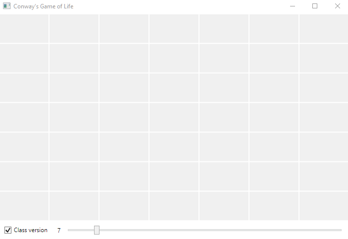
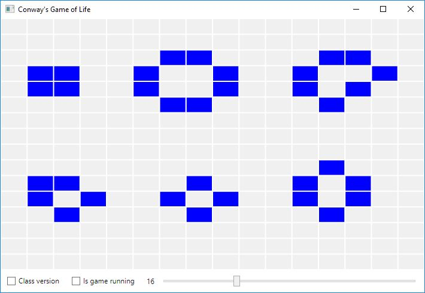
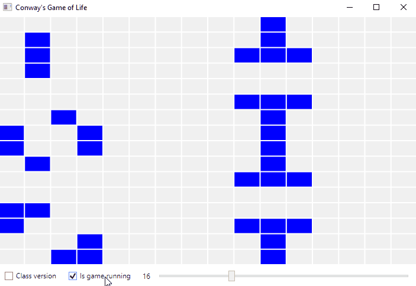

# :game_die: Conway's game of life
The *Game of Life*, also known as *Life*, is one of the first cellular automations that was discovered by a british matematician John Conway. The evolution of the game is based on its initial state. This is the only user input required in this game.

## Game rules

The game consists of a grid of cells. Each cell can be in one of two states: dead or alive. Its state evolves through generations:
* if the cell is alive, it stays alive only when it has **three** alive neighbors
* if the cell is dead and has **two** or **three** alive neighbors, it becomes alive
* otherwise the cell is dead in the next generation

## Interesting patterns
There are certain patterns that have particular properties. Some of them remain constant and do not evolve through generations. Some of them are oscilating through a number of well known patterns.

### Still lifes

### Oscillators

## :link: Useful links
:game_die: [Conway's Game of Life on Wikipedia](https://en.wikipedia.org/wiki/Conway%27s_Game_of_Life)
